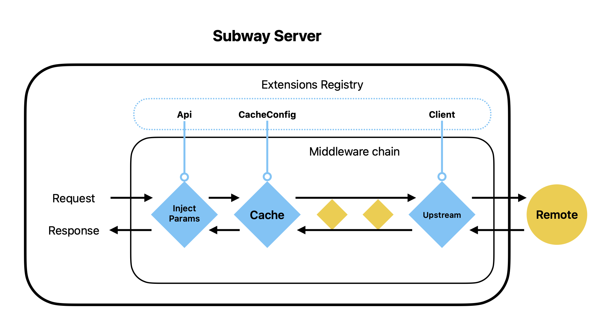

# Subway

Substrate JSON RPC Gateway.

This is a generalized JSON RPC proxy server with features specifically designed for Substrate RPC and Ethereum RPC.



## Getting Started

Pull vendors: `git submodule update --init --recursive`

Quick start: `cargo run -- --config configs/config.yml`

This will run a proxy server with [config.yml](configs/config.yml) as the configuration file.

Run with `RUSTFLAGS="--cfg tokio_unstable"` to enable [tokio-console](https://github.com/tokio-rs/console)

## Environment Variables

- `RUST_LOG`
  - Log level. Default: `info`.
- `LOG_FORMAT`
  - Log format. Default: `full`.
  - Options: `full`, `pretty`, `json`, `compact`

In addition, you can refer env variables in `config.yml` by using following syntax:

- `${variable}`
- `${variable:-word}` indicates that if variable is set then the result will be that value. If variable is not set then word will be the result.
- `${variable:+word}` indicates that if variable is set then word will be the result, otherwise the result is the empty string.

## Features

Subway is build with middleware pattern.

### Middlewares

**Method Middlewares**

- Cache
  - Cache responses from upstream middleware.
- Call
  - Forward requests to upstream servers.
- Inject Params (Substrate)
  - For Substrate RPC
  - Inject optional `blockAt` or `blockHash` params to requests to ensure downstream middleware such as cache can work properly.
- Inject Params (Ethereum)
  - For Ethereum RPC
  - Inject optional `defaultBlock` parameter to requests to ensure downstream middleware such as cache can work properly.
- Subscription
  - Forward requests to upstream servers.
  - Merge duplicated subscriptions.
- Rate Limit
  - Rate limit requests from downstream middleware.
- TODO: Parameter filter
  - Deny requests with invalid parameters.

### Additional features

- Advance JSON RPC Client
  - Supports multiple upstream servers and rotate & reconnect on failure.
  - TODO: Load balance requests to upstream servers.
- Batch Request
  - TODO: Process requests individually so they can be cached properly by downstream middlewares.
  - TODO: Limit batch size, request size and response size.
- TODO: Metrics
  - Getting insights of the RPC calls and server performance.

## Benchmarks

To run all benchmarks:

```
cargo bench
```

It's also possible to run individual benchmarks by:

```
cargo bench --bench bench ws_round_trip
```

## Validate Middleware

This middleware will intercept all method request/responses and compare the result directly with healthy endpoint responses.
This is useful for debugging to make sure the returned values are as expected.
You can enable validate middleware on your config file.

```yml
middlewares:
  methods:
    - validate
```

NOTE: Keep in mind that if you place `validate` middleware before `inject_params` you may get false positive errors because the request will not be the same.

Ignored methods can be defined in extension config:

```yml
extensions:
  validator:
    ignore_methods:
      - system_health
      - system_name
      - system_version
      - author_pendingExtrinsics
```
